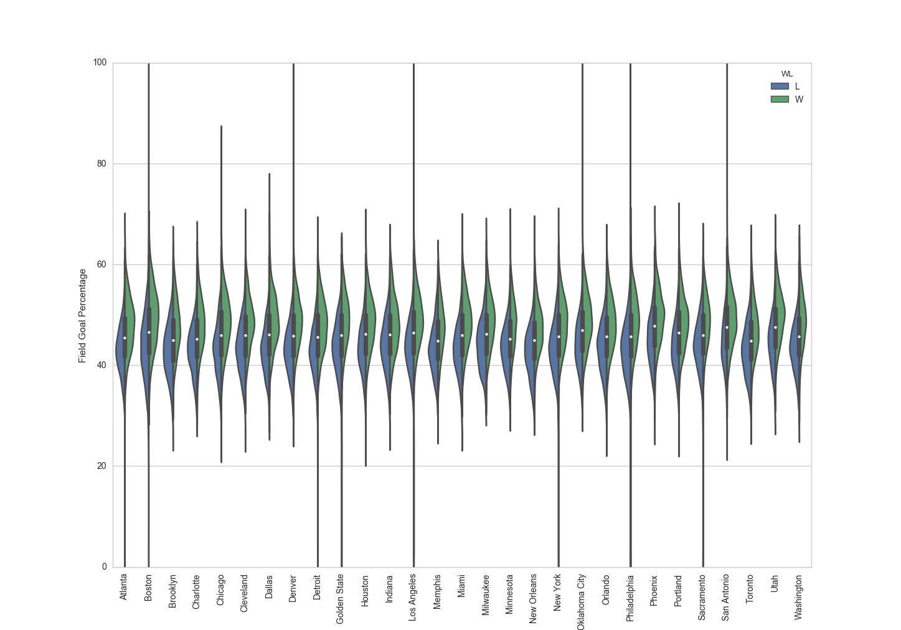

# NBA-Stats-Fun
Python code used to scrape NBA stats from the web and contextualize.

The required Python modules are at the top of each Python script.  You will likely need to install nba_py.  To do this, simply issue the following command:

```
$ pip install nba_py
```

You can execute get_teams.py from the command prompt as follows:

```
$ python get_teams.py
```

Provided you have Internet access, you'll see several .csv files (each belonging to a different NBA team) fill up in your working directory.  To start processing this data, execute plot_teams.py (in the same directory) as follows:

```
$ python plot_teams.py
```

This will generate a violin plot conveying each team's field goal percentage distribution throughout its history.


